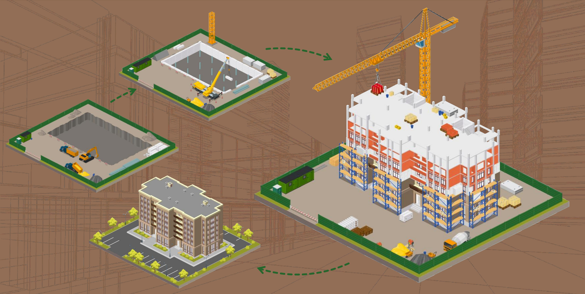

# Residential Complex Construction Management System

## Project Overview
This application is a construction project management service tailored for building companies and private enterprises (PP) involved in the development of residential complexes (RC). 
The system allows construction stakeholders to efficiently plan, monitor, and manage housing development projects with different levels of access and control.

## Key Features
1. **Role-based access for various users:**
    - _General Contractors:_ Manage and edit project data.
    - _Company Owners:_ Approve projects and contractors, view progress.
    - _RC Owners and Residents:_ View read-only information and construction status.
2. **Secure Government Authentication:**
    - Authentication is conducted through a secure, government-provided service to verify identities and prevent impersonation.
3. **Visual Progress Tracking:**
    - _Icogram:_ Modular vector graphics that visually represent construction stages.
    - _Gantt-like Timeline:_ Diagram for visualizing project phase durations and dependencies.
